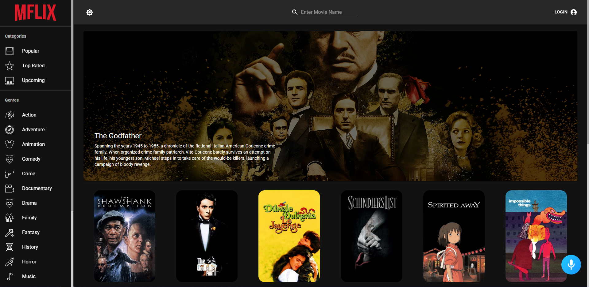
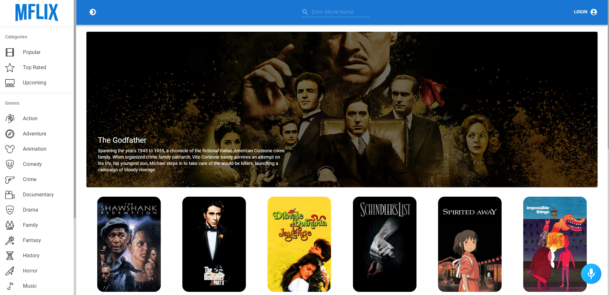
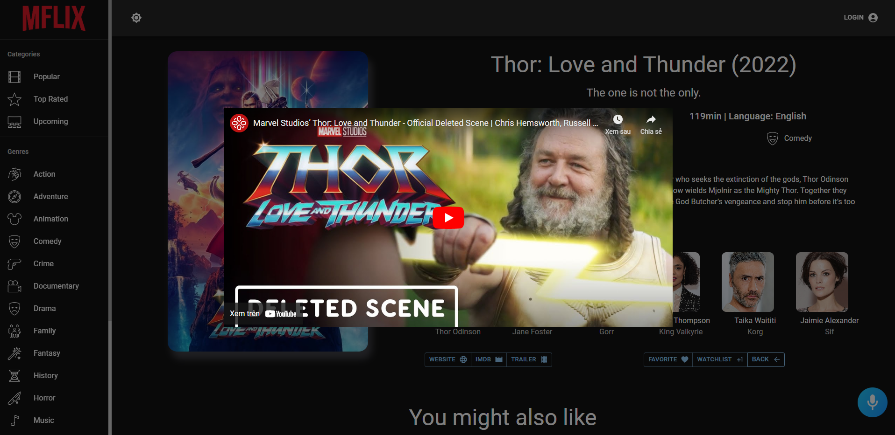
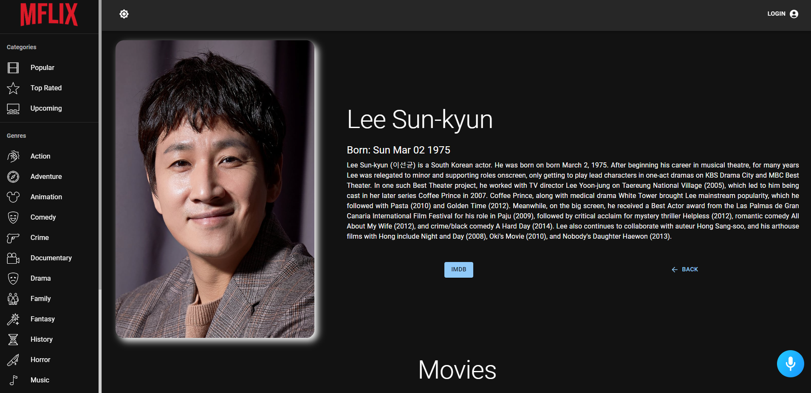
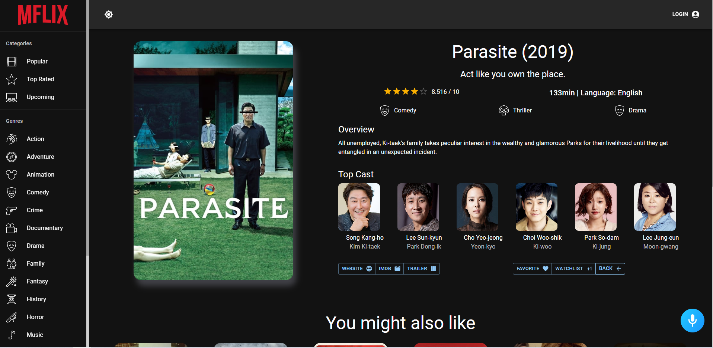

# Mflix application

## About The Project
 - This project using https://www.themoviedb.org/ api
 - Bright/dark mode
 - Login/Logout user
 - Search for movie 
 - Add movie to your watch list
 - Like a movie
 - Talking to Alan AI assistant, some command you can use to interact with Alan:
    - "what does this app do", "what is this app"
    - "Log in", "Log out"
    - "Search for \< Movie name \>" (exp: "search for Minion")
    - "Go to \< Genre \>" (exp: "go to comedy")
    - "i want to get scared"
 
 ## Screenshots
 
 |                                     |                                     |                                     |
|                    :---:            |                :---:                |                   :---:             |
|  |  |  |
| |  |

## Getting Started
1. Clone this repo by: `git clone https://github.com/thinh19981998/mflix.git`
2. Install all the packages by: `npm install`
3. Rename the `.env.example` to `.env`
4. Run `npm start` 

